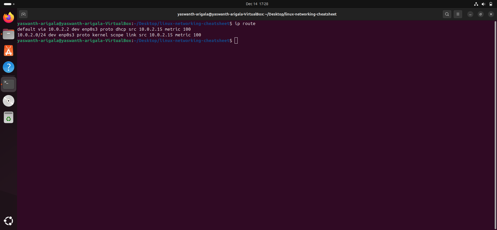
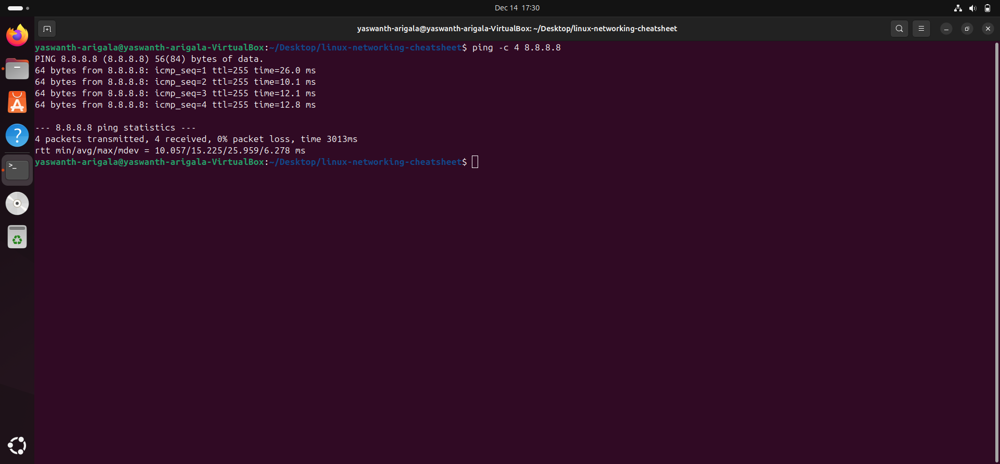
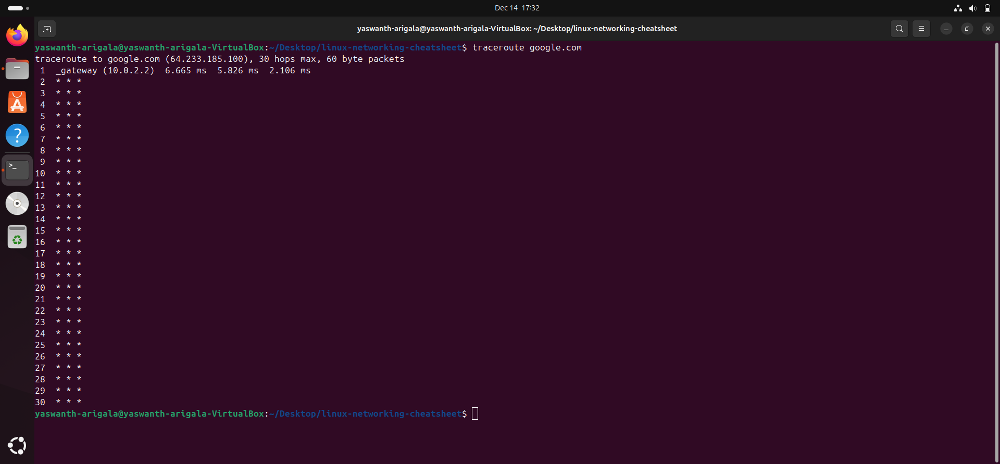
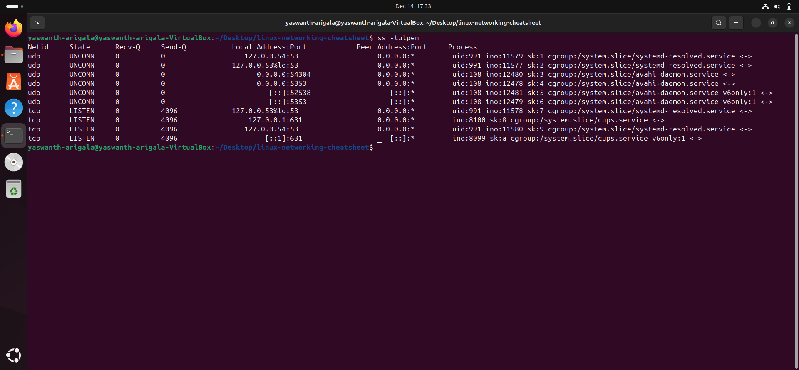
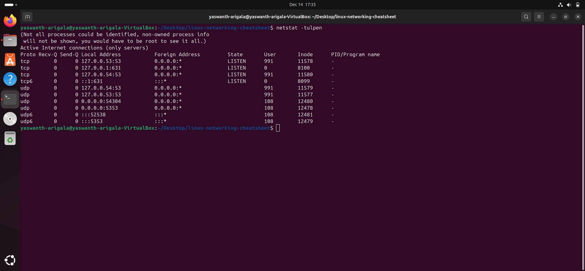

# Linux Networking Commands Cheatsheet
This project demonstrates core Linux networking commands with their purpose,
real-world use cases, and actual command output screenshots taken from Ubuntu
running inside VirtualBox.
---


##2️⃣ ip route
###Command:
```bash
ip route

Purpose:
Shows the routing table and default gateway used by the system.

Real-world example:
Helps determine the default router and understand how network traffic is routed.

**Screenshot:**



##3️⃣ ping
###Command:
```bash
ping -c 4 8.8.8.8

Purpose:
Tests network connectivity and measures latency using ICMP packets.

Real-world example:
Used to check whether the internet or a remote server is reachable.

**Screenshot:**



##4️⃣ traceroute
###Command:
```bash
traceroute google.com

Purpose:
Displays the path (hops) that packets take to reach a destination.

Real-world example:
Used to identify where network delays or packet loss occur across networks.

Screenshot:


##5️⃣ ss
###Command:
```bash
ss -tulpen

Purpose:
Shows active sockets, listening ports, and associated processes.

Real-world example:
Used by system administrators to check which services are listening on which ports.

Screenshot:


##6️⃣ netstat
###Command:
```bash
netstat -tulpen

Purpose:
Displays network connections, routing tables, and listening ports (legacy tool).

Real-world example:
Used for troubleshooting network services on older Linux systems.

**Screenshot:**

